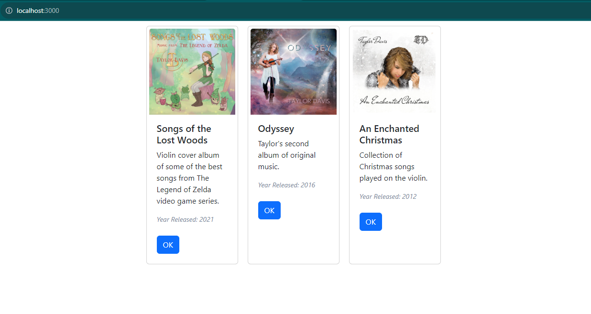

### Jamie Lewis
### CST-391
### 9/22/23
### Instructor Bobby Estey

---

<div style="text-align:center;"><h3>Activity 5: React Tools & Music App Fixed Data</h3></div>


### PART 1: React Music App Introduction 

#### Screenshot


#### Summary

In part 1 of this activity, the app was split into custom components. The custom components have an export that can be imported into another component.
- First, Card.js creates a template for a Card element that can be reused and have custom properties (props) assigned.
- Then, App.js was separated out from the main index.js script.

It should be noted that the initial setup instructions are outdated. We have to use createRoot now, instead of ReactDOM The final version of index.js should look like this:

```
import React from 'react';
import { createRoot } from 'react-dom/client';
import App from './App';

const container = document.getElementById('root');
const root = createRoot(container);

root.render(<App />);
```

### Mini App - State Changer Demo

#### Screenshot


#### Description

- The 1st Counter is in its default state. The message is populated with the title prop (property). The counter is initialized to 0. The input text value is also initialized to the title.
- The 2nd Counter is being used to demonstrate the button's onClick event. I clicked the button 8 times.
- The 3rd Counter demonstrates the onChange event that is being used by the input. I simply typed "Modified Message Counter" into the input box and message's state updates automatically via the event hook.

### Part 2: Using State and Props in the Music App

#### Screenshot



> Note: I reused the album data from Part 1 rather than the data provided in the instructions. I also updated the Card class to add the 'year' data into the card, with custom CSS properties, reinforcing that I understand the concepts being taught in the assignment.

#### Summary

In this stage of the music app, we implemented features from the latter section of Part 1. The introduction of the music app used properties to customize the Card class object. Now, the App introduces an albumList object with a state that can be updated dynamically. For the time being, the initial state is hard-coded, and no method had been implemented to update it. The method name 'setAlbumList' has been declared, but is not defined or used. The map function was also examined. The array of Card objects are created by iterating over the albumList and instantiating a new Card for each album in the list.

Demonstrating the flow of the application, I did the following to add the year data to each card:

- In App.js, I added this line to the Card definition in the map function's return value:  
  ```
  year={album.year}
  ```
- Then, in Card.js, I added the following line between the description and the button:  
  ```
  <div className="card-text note">Year Released: { props.year }</div><br/>
  ```
- Finally, I added a Card.css file to the project and imported it into Card.js.
  - Card.css contents:
    ```
    .note
        {
            font-size: 14px;
            color: lightslategray;
            font-style: italic;
        }
    ```
  - Card.js import:
    ```
    import './Card.css';
    ```
