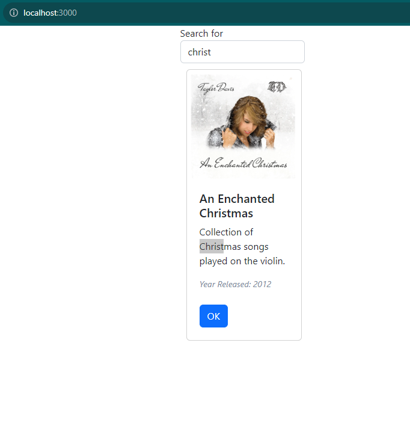

### Jamie Lewis
### CST-391
### 9/30/23
### Instructor Bobby Estey

---

<div style="text-align:center;"><h3>Activity 6: React Music App API Data</h3></div>


### PART 3: External Data Source 

> Note: Because I am not a Beatles fan, I removed the Beatles albums from my database and added in a few that I actually like.

#### Screenshots

Default Application Page


Searching - Exact Match


Searching - Partial Match



#### Summary

In this iteration of the music app, the data source was changed to use the previously developed REST API to retrieve album data from a MySQL database. Along the way, the React Hooks Lifecycle was examined, specifically the ```useEffect()``` method. App.js was updated to use asynchronous methods for retrieving the data from the database, replacing the static data. A search box was also implemented, using ```<SearchForm />```, for filtering the displayed data. This was a Bootstrap Component modified to work with JSX. Handler methods were added to manipulate the displayed content in the event of submitting a term in the search box. Finally, Axios was installed in order to interface with the MusicAPI application efficiently and with error checking.

### Mini App #2 - Routing App Demo

#### Screenshot

Main Page


About Page - Not Logged In


About Page - After Login


Contact Us Page - Already Logged In


Login Page - Using Navbar Link


User Page - Current User


Other User


#### Summary

The routing app demonstrates how to use the Router module to manage the user's view. This includes disabling access to certain links when a user is not logged in via a ```<PrivateRoute />``` element. In this case, the About and Contact Us pages are protected. So, for example, when the "About" link is clicked on while the user is not logged in, the information from that page is not displayed, but a Login button is shown instead. Once the user logs in and then attempts to visit "About", the relevant page information is displayed. "Contact Us" is also protected in the same way in this demo.

> Note: I used my own game studio data for the "About" and "Contact Us" pages rather than the default placeholder data.

### Part 2: Using State and Props in the Music App

#### Screenshots

Main Page


New Page (to be developed in next activity)


Search Result


#### Summary

For the final part of this Activity, the routing and navigation from the Routing App Demo was applied to the Music App. For the Music App, the Navbar contains links for *Main* and *New*. *New* is to be a form page for adding a new music album to the database, which will be developed in a future Activity assignment. On *Main*, a user can still search for an album by description. As the code is given in the assignment instructions, clearing the search box and hitting **ENTER** returns a 404 HTTP error. I corrected this by updating the updateSearchResults method with an *if* statement that simply returns the full list of Albums if the search phrase is empty, as follows:

```
    const updateSearchResults = async (phrase) => {
    console.log('phrase is ' + phrase);
    setSearchPhrase(phrase);
    if (phrase === '') {
      loadAlbums();
    }
    else
    {
      const response = await dataSource.get('albums/search/description/' + phrase);
      setAlbumList(response.data);
    }
  };
```

I also noticed that no matter how I search or where I click, the *OneAlbum* module never gets loaded. I am under the impression that it should happen when the OK button on an Album's card is clicked, but it does not work. I tried a few things to see if I could get it working, but did not have any luck. Perhaps I missed something in the instructions after going over everything five times, or this will be resolved in the final Activity.
