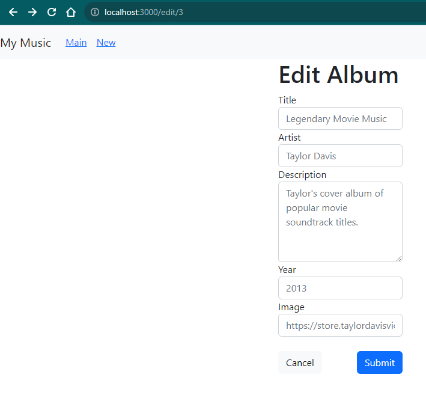

### Jamie Lewis
### CST-391
### 10/6/23
### Instructor Bobby Estey

---

<div style="text-align:center;"><h3>Activity 7: React Music App Completion</h3></div>


### Mini App #3 (Blog) - Dynamic Components Demo

#### Screenshots

Main Page W/Static Data


Added A Post (#4)


Deleted A Post (#3)


### Part 5: Tracks, Lyrics, & Video (Optional)

#### Screenshots

OneAlbum Page from Activity 6


#### Summary

During Activity 6, I was unable to get the OneAlbum page to even load. I finally did figure out what was missing in the instructions. Since this part of the activity is marked as optional, I won't take this any farther, because I need to complete parts 6 & 7 as well as work on the Milestone project. The code I corrected to get the page to even work at all was in the AlbumList.js and Card.js files. In AlbumList, I changed line 25 from ```onClick={handleSelectionOne}```, as the instructions showed, to ```onClick={() => handleSelectionOne(album.albumId)}```. In Card, I added the property ``` onClick={props.onClick}``` to the div on line 6.

### Part 6: Create New Album

#### Screenshots

New Album Page


Updated Album List


#### Summary

In part 6, NewAlbum.js was built out to allow the creation of a new album in the database. A simple form was derived from a Bootstrap example to take in properties of the new album. When the form is submitted, the data is asynchronously pushed to the database and the client is automatically routed back to the main page. In App.js, the method is added that handles the routing. In Route, the NewAlbum element's onNewAlbum property handles the communication path.

#### More to Do (Optional)

The only optional item completed is the automatic routing back to the main page with the updated album list. The rest of the optional items listed are being skipped for the same reason as part 5.

### Part 7: Edit An Album

#### Screenshots

Updated New/Edit Page



Main Page


#### Summary

The NewAlbum.js file was modified to handle both new album creation and editing of existing albums. I added properties to the form inputs to update the placeholder text for the respective type of form. Creating a new album uses the old placeholder text while editing an album includes the selected album's current data. An additional Route was added to App.js for handling the routing, and the updateSingleAlbum method was modified to accept a uri parameter, which is passed in from clicking on an Edit button. 

#### Unfinished Business

As in part 6, the automatic routing to and updating of the main page is completed. I also handled the use of the cancel button. The rest of the optional items listed are being skipped for the same reason as part 5.

> Note: During this section, I noticed the instructions outlined a different way to handle the loading of OneAlbum than I figured out for part 5. I updated my code to match the newest instructions. I should also note that, in my file structure, I meant to make copies of the project as I iterated over the parts of the assignment, but I forgot to do that along the way, so everything got updated under the music-5 folder.

