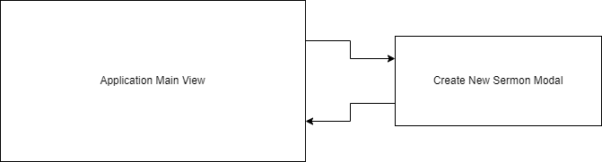

#### Jamie Lewis
#### CST-391
#### 8/26/23
#### Instructor Bobby Estey

---

<h3>Milestone 1: Project Proposal</h3>

 
 
 

<h3>Sermon Archive Manager (SAM)</h3>

 
 
 
 
 

---

### Introduction

I run the media room in our church, and a few months ago I had to spend several hours going back through our archives to find all of the 108 sermons that belong to a certain series that spanned about 4 years. It would be really nice if I could just click a few buttons to retrieve a collection of the audio files that belong to any sermon series, were based on a given reference, or were from a given date.

Sermon Archive Manager (SAM) will allow just that. The "product" for this app is a Sermon. A Sermon has a title, speaker,  date, series (optional), Bible reference(s), and a file path to the audio recording.

The plan is to make a single page application that contains a list of all Sermons initially. Filters can be applied which auto-update the list. Filters will include 2 boxes for typing in searches, one for Sermon titles and one for references. There will be a dropdown automatically populated with all available series names. The button for resetting filters restores the full list. An "Add Sermon" button opens a modal, which has a form for creating the new Sermon. It will have "Submit" and "Cancel" buttons. The main application view also has "Edit" and "Delete" buttons which work only on the selected Sermon. When the list is loaded or refreshed, the top item is auto-selected.

---

### Functionality (User Stories)

- Display all Sermons
- Filter Sermons by series
- Filter Sermons by searching titles
- Filter Sermons by searching references
- Create a new Sermon
- Update a Sermon
- Delete a Sermon

---

### Database Design

;

---

### Sitemap Flowchart

---

### UI Wireframes

---

### UML Class Diagram

---

### Risks

- ?
