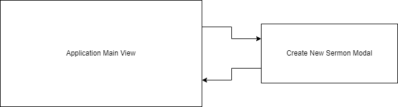

#### Jamie Lewis
#### CST-391
#### 9/2/23
#### Instructor Bobby Estey

---

<h3>Milestone 3: Rest API using Express Framework</h3>

 
 
 

<h3>Sermon Archive Manager (SAM)</h3>

 
 
 
 
 

---

### Design Updates

The overall design remains unchanged this week. The following table outlines updates to the project and this document, and is followed by a TODO list.

| Section Updated | Change(s) Made | Milestone/Week Update Performed
| -- | -- | -- |
| Design Updates | renamed from "Instructor Feedback From Previous Milestone & Changes Made" | Milestone 3/Week 2 |
| How Feedback Will Be Addressed | removed | Milestone 3/Week 2 |
| Description | renamed from "Introduction" | Milestone 3/Week 2 |
| UML Class Diagram | changed data type for series from string[] to string | Milestone 3/Week 2 |
| REST API | added API documentation sub-section | Milestone 3/Week 2 |
| | | |
<!-- for future Milestone updates
| | | Milestone 4/Week 4 |
| | | Milestone 5/Week 7 |
| | | Milestone 6/Week 8 |
-->

#### TODO
- Date column in MySQL database currently defaults to a current timestamp when creating a Sermon entry, to simplify initial API testing. This should get changed to needing to be supplied by the client, so that they can create the Sermon with the date it was recorded, rather than when it was added to SAM. The original plan is for a date picker in the UI, which will allow this.
---

### Description

I run the media room in our church, and a few months ago I had to spend several hours going back through our archives to find all of the 108 sermons that belong to a certain series that spanned about 4 years. It would be really nice if I could just click a few buttons to retrieve a collection of the audio files that belong to any sermon series or speaker, were based on a given Bible reference, or contained a keyword in the title.

Sermon Archive Manager (SAM) will allow just that. The "product" for this app is a Sermon. A Sermon has a title, speaker,  date, series (optional), Bible reference(s), and a file path to the audio recording.

The plan is to make a single page application that contains a list of all Sermons initially. Filters can be applied which auto-update the list. Filters will include 2 boxes for typing in searches, one for Sermon titles and one for references. There will be dropdowns automatically populated with all available series and speaker names. The button for resetting filters restores the full list. An "Add Sermon" button opens a modal, which has a form for creating the new Sermon. It will have "Submit" and "Cancel" buttons. The main application view also has "Edit" and "Delete" buttons which work only on the selected Sermon. When the list is loaded or refreshed, the top item is auto-selected.

---

### Functionality (User Stories)

- Display all Sermons
- Filter Sermons by series
- Filter Sermons by speaker
- Filter Sermons by searching titles
- Filter Sermons by searching references
- Create a new Sermon
- Update a Sermon
- Delete a Sermon

---

### Database Design

---

### Sitemap Flowchart

---

### UI Wireframes

---

### UML Class Diagram

---

### REST API

Format for the following API calls: [HTTP Method] methodName {URI, root not included}

- [GET] readAllSermons {/sermons}
- [GET] readSermonById {/sermons?id=#}
- [GET] readSermonBySeries {/sermons?series=seriesName}
- [GET] readSermonBySpeaker {/sermons?speaker=seriesName}
- [GET] readSermonByTitleSearch {/sermons/search/title/:searchTerm}
- [GET] readSermonByReferenceSearch {/sermons/search/reference/:searchTerm}
- [POST] createSermon {/sermons}
- [PUT] updateSermon {/sermons}
- [DELETE] deleteSermon {/sermons}

#### API Documentation

---

### Risks

- User input will need to be sanitized to guard against SQL injection.
- I hope I haven't gotten too ambitious with the feature set for this project.
