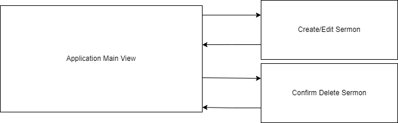

#### Jamie Lewis
#### CST-391
#### 10/14/23
#### Instructor Bobby Estey

---

<h3>Milestone 6: Presentation</h3>

 
 
 

<h3>Sermon Archive Manager (SAM)</h3>

 
 
 
 
 

---

### Design Updates

This week concludes the Milestone project with a final presentation video. The following items are addressed in the video:

- An end-to-end project demonstration
- Technical review (including code)
- Discussion of web development from a Christian worldview
- Discussion of website accessibility

Please bear with me and my voice for the presentation video in light of me still being ill at the time of recording.

Not all planned features were able to be implemented in either front-end application before the end of class. I had intended to attempt to add some of them to the React app this week, but I got sick. So, I tinkered with trying to fix the Angular's edit functionality instead, but to no avail. 

| Section Updated | Change(s) Made | Milestone/Week Update Performed
| -- | -- | -- |
| Design Updates | renamed from "Instructor Feedback From Previous Milestone & Changes Made" | Milestone 3/Week 2 |
| How Feedback Will Be Addressed | removed | Milestone 3/Week 2 |
| Description | renamed from "Introduction" | Milestone 3/Week 2 |
| UML Class Diagram | changed data type for series from string[] to string | Milestone 3/Week 2 |
| REST API | added API documentation sub-section | Milestone 3/Week 2 |
| | | |
| Design Updates | updated information to be relevant to Milestone 4 | Milestone 4/Week 4 |
| User Stories | Added subheadings to indicate completion status | Milestone 4/Week 4 |
| | | |
| Design Updates | updated information relevant to Milestone 5 | Milestone 5/Week 7 |
| User Stories | updated items under subheadings for the state of the React app | Milestone 5/Week 7 |
| Database Design | updated diagram image | Milestone 5/Week 7 |
| Sitemap Flowchart | updated diagram image | Milestone 5/Week 7 |
| UI Wireframes | updated diagram image | Milestone 5/Week 7 |
| UML Class Diagram | updated diagram image | Milestone 5/Week 7 |
| TODO | updated with outstanding issues | Milestone 5/Week 7 |
| Presentation Video Link | added section with YouTube Link | Milestone 5/Week 7 |
| | | |
| Presentation Video Link | updated link for final presentation | Milestone 6/Week 8 |
|

#### TODO

- Minor additions to be added to the API documentation, even though they are not currently used within the application.

---

### Final Presentation Video Link

https://youtu.be/qgJ45y_APd0

---

### Description

I run the media room in our church, and a few months ago I had to spend several hours going back through our archives to find all of the 108 sermons that belong to a certain series that spanned about 4 years. It would be really nice if I could just click a few buttons to retrieve a collection of the audio files that belong to any sermon series or speaker, were based on a given Bible reference, or contained a keyword in the title.

Sermon Archive Manager (SAM) will allow just that. The "product" for this app is a Sermon. A Sermon has a title, speaker,  date, series (optional), Bible reference(s), and a file path to the audio recording.

The plan is to make a single page application that contains a list of all Sermons initially. Filters can be applied which auto-update the list. Filters will include 2 boxes for typing in searches, one for Sermon titles and one for references. There will be dropdowns automatically populated with all available series and speaker names. The button for resetting filters restores the full list. An "Add Sermon" button opens a modal, which has a form for creating the new Sermon. It will have "Submit" and "Cancel" buttons. The main application view also has "Edit" and "Delete" buttons which work only on the selected Sermon. When the list is loaded or refreshed, the top item is auto-selected.

---

### Functionality (User Stories)

Completed

- Display all Sermons
- Create a new Sermon
- Delete a Sermon
- Update a Sermon
- Filter Sermons by searching titles

Planned, but not started.

- Filter Sermons by series
- Filter Sermons by speaker
- Filter Sermons by searching references

---

### Database Design

---

### Sitemap Flowchart

---

### UI Wireframes

---

### UML Class Diagram

---

### REST API

Format for the following API calls: [HTTP Method] methodName {URI, root not included}

- [GET] readAllSermons {/sermons}
- [GET] readSermonById {/sermons?id=#}
- [GET] readSermonBySeries {/sermons?series=seriesName}
- [GET] readSermonBySpeaker {/sermons?speaker=seriesName}
- [GET] readSermonByTitleSearch {/sermons/search/title/:searchTerm}
- [GET] readSermonByReferenceSearch {/sermons/search/reference/:searchTerm}
- [POST] createSermon {/sermons}
- [PUT] updateSermon {/sermons}
- [DELETE] deleteSermon {/sermons}

#### API Documentation

---

### Risks

- User input will need to be sanitized to guard against SQL injection.
- I hope I haven't gotten too ambitious with the feature set for this project.
